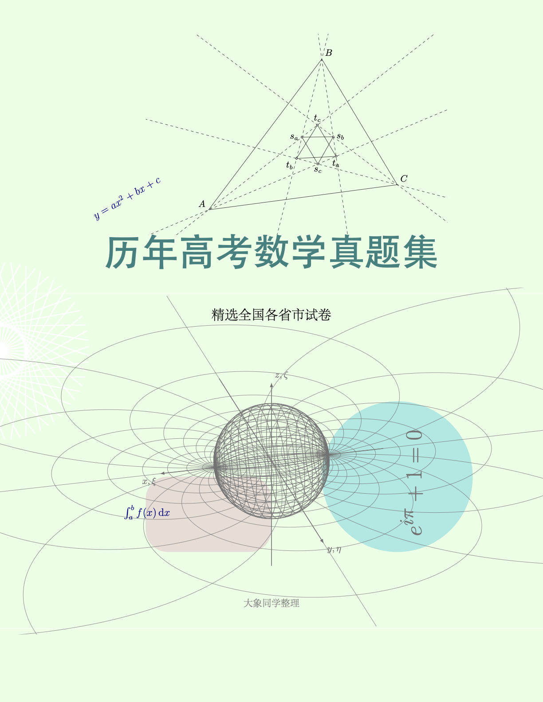

# Why
我在2024年突然间一个想法,想做点数学题来锻炼锻炼已经年久失修的脑子,正好也学习学习LaTeX的一些实际的写法,就在网上找数学题,中文网上很多垃圾,所以刚开始我是在国外的网站上找了一点题来练习.后来在B站上偶然发现了[这个视频](https://www.bilibili.com/video/BV1Sk4y1Z7jG/?spm_id_from=333.1387.favlist.content.click&vd_source=e45034e5fdc28a425d6b68ec04611379),里面有大量的习题可以用来练习.强烈推荐[这个网盘](https://docs.qq.com/sheet/DTkRSbGFZRWhnb1Z2?tab=sod4da)里面的内容.

# What
这个仓库会放我解题的经过，试卷会分别编译成不带答案和带答案的。相比起网上很多的Word版的数学试卷而言，内容会看起来更美观，图片都是用LaTeX绘制的。但是也可能会存在一些错误。

# Table of Contents
- 封面

这个是我用tikz随意画的，😄
- 试卷内容
  - 1977 年高考数学试卷及答案 (北京卷) 理科
  - 1977 年高考数学试卷及答案 (福建卷) 理科
  - 1977 年高考数学试卷及答案 (河北卷) 理科
  - 1977 年高考数学试卷及答案 (黑龙江) 理科
  - 1977 年高考数学试卷及答案 (江苏卷) 理科
  - 1977 年高考数学试卷及答案 (上海卷) 理科
  - 1977 年高考数学试卷及答案（天津卷）理科
  - 1978 年高考数学试卷及答案（天津卷）文理
  - 1997 年高考数学试卷及答案 (全国卷) 理科
  - 1998 年高考数学试卷及答案 (全国卷) 理科

# Copyleft

请随意分享
